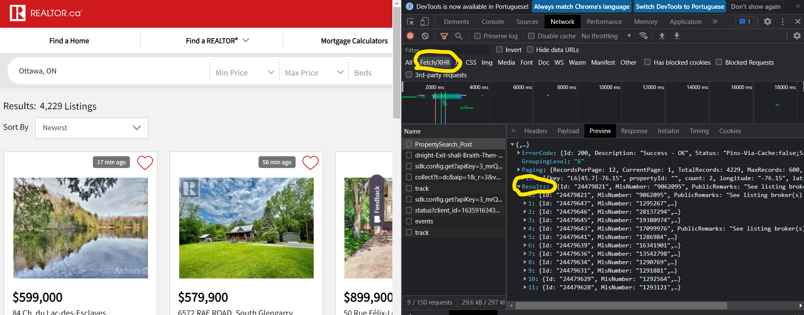

# SP_003-API_Scraping

# Objetivo

  O principal objetivo deste projeto é executar a raspagem de um site de venda de casas utilizando sua API escondida (hidden API). Após efetuar a raspagem do site, os dados são organizados e salvos em um dataframe. Esse projeto foi baseado no trabalho desenvolvido no curso *API Scraping - Web Scraping Real Estate Data + PostgreSQL*¹

# Introdução
  O primeiro passo é entender o que é uma API, e porque ela estaria escondida. A sigla **API** significa Application Programming Interface², que pode ser traduzida como Interface de Programação de Aplicação. Basicamente, uma API é um conjunto de normas e protocolos especificados por uma empresa que permite a comunicação e compartilhamento dos seus dados entre as plataformas. Isso possibilita que desenvolvedores possam criar softwares e aplicativos utilizando dados e aplicações de terceiros, criando sistemas mais complexos de forma simples, já que não há a necessidade de criar as interfaces do zero.
  Em relação às APIs escondidas, alguns sites usam estruturas de front-end que renderizam conteúdo dinâmico carregando um arquivo JSON ou XML de seu back-end para preencher o site voltado para o usuário³. Essa comunicação é feita por uma API que não está exposta, e se identificarmos a requisição que faz essa comunicação, podemos facilmente interceptar e capturar os dados que desejamos.
# Projeto 
  O primeiro passo é acessar/encontrar no site as informações que procuramos. O site escolhido é o https://www.realtor.ca/, do qual nos propomos a obter dados básicos dos imóveis e os dados de contato do vendedor responsável para imóveis em Ottawa. 
  Após acessar o site e filtrar a localização, verificamos na ferramenta do desenvoldedor a requisição responsável responsável pela busca dos dados. Na ferramenta, na aba Network, em Fecth/XHR podemos identificar a requisição comparando a estrutura dos resultados com a estrutura da própria requisição.XHR é o protocolo utilizado pelos sites para a comunicação entre os sites e as APIs
  O procedimento de identificação é simples. Com a ferramenta de inspeção do navegador, vamos até os 
dados que queremos raspar. Efetua-se uma nova requisição com o filtro Fetch/XHR. É possível identificar um padrão entre o resultado da busca na página e a estrutura da requisição, o que permite a identificação

  Vale lembrar que o formato da requisição muda de um site para outro, de forma que isso não pode ser encarado como um procedimento geral. Cada site/api necessitará de uma abordagem apropriada. Após encontrar a requisiçao, é possível baixa-la em formato cURL (cmd), que depois deve ser convertido. Utilizamos um site de terceiros para converter a linguagem da requisição para uma requisição em python a fim de podermos utilizar todo o poder das bibliotecas do python. O site utilizado para conversão foi o https://formatter.xyz/curl-to-python-converter
  Após a conversão, o request foi tratado e os dados raspados utilizando laços em python e em seguida os dados foram salvos em um dataframe do pandas e uma arquivo .csv.
  
# Referências
1 - https://www.udemy.com/course/api-scraping-web-scraping-real-estate-data-postgresql
2 - https://www.ibm.com/cloud/learn/api
3 - https://ianlondon.github.io/blog/web-scraping-discovering-hidden-apis/

